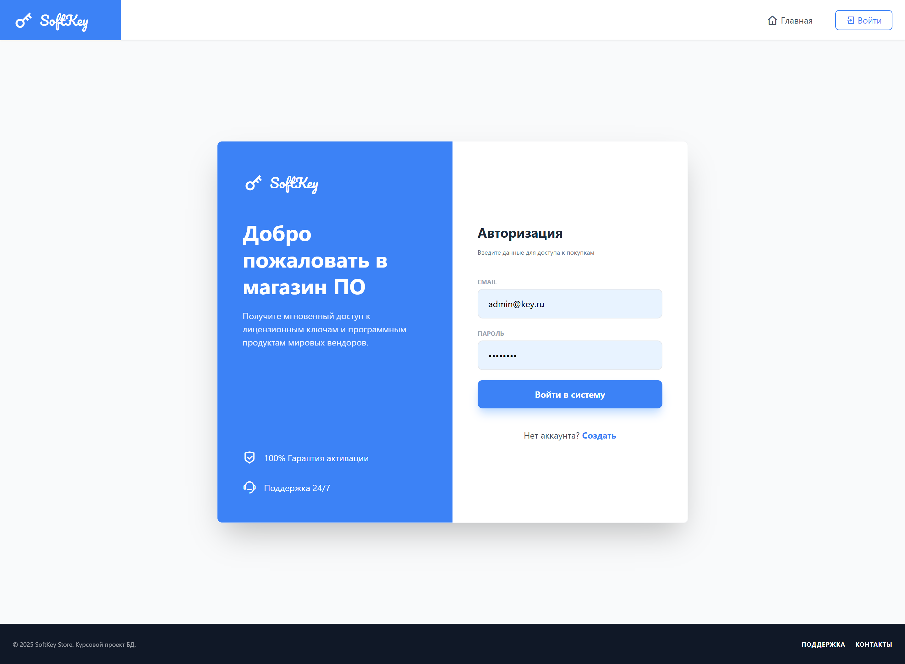
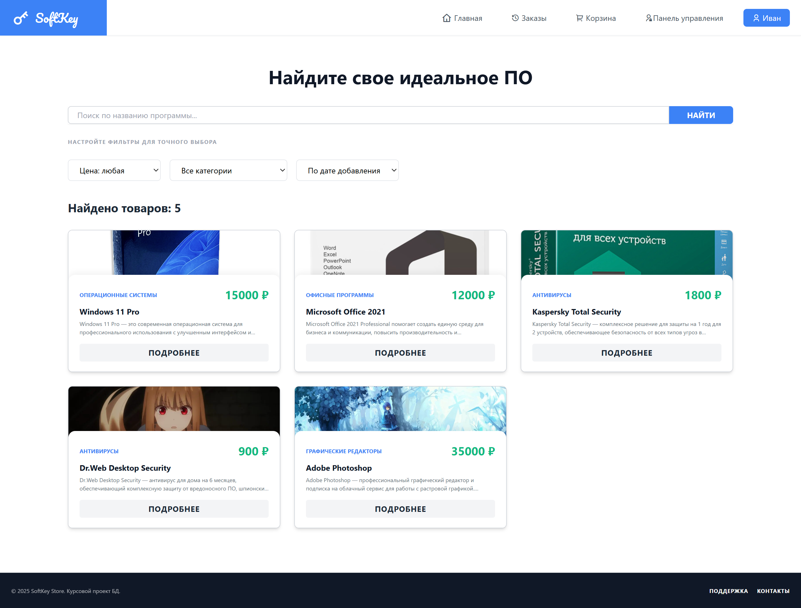
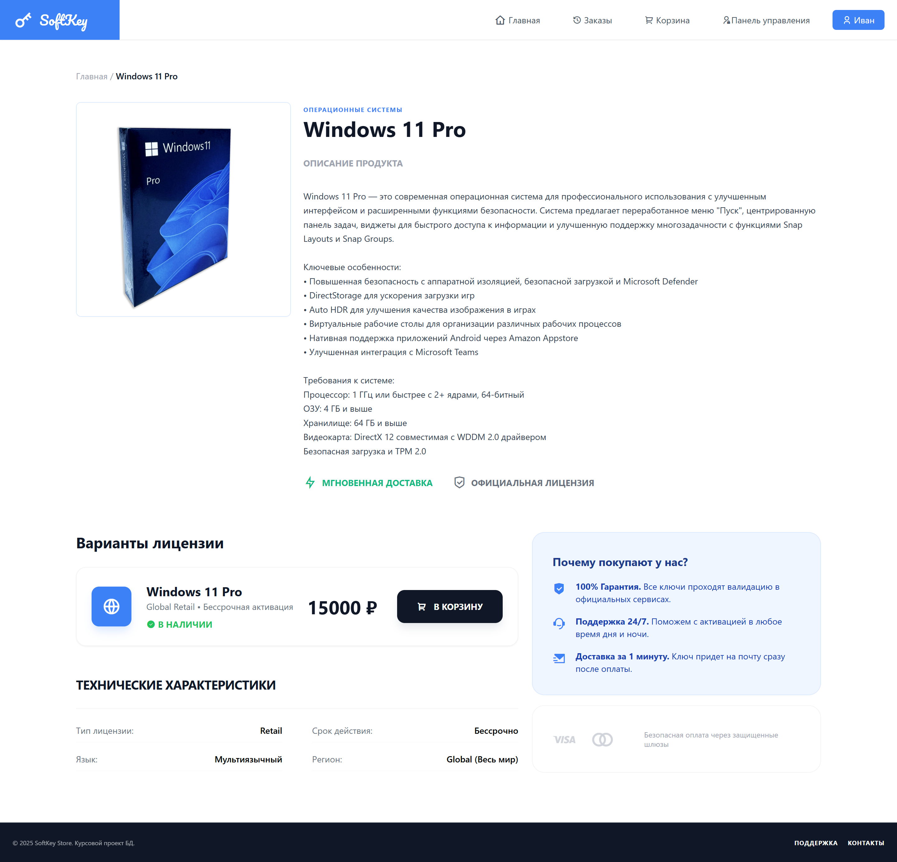
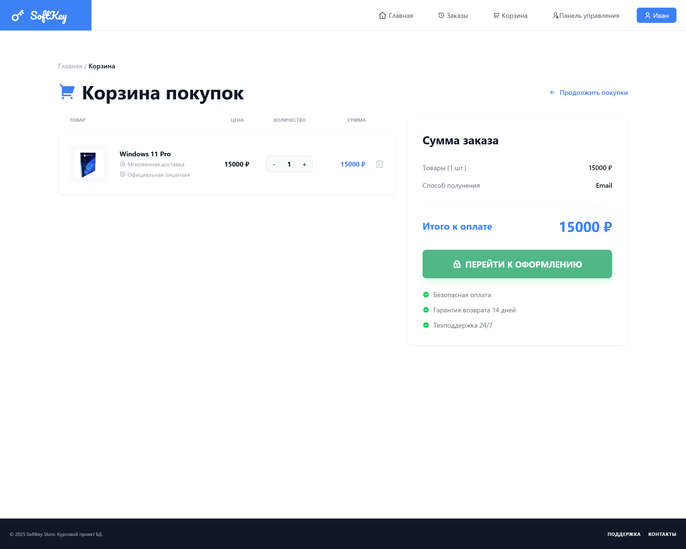
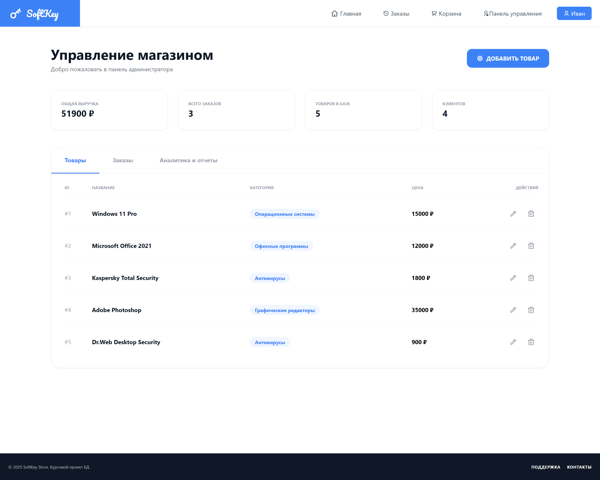
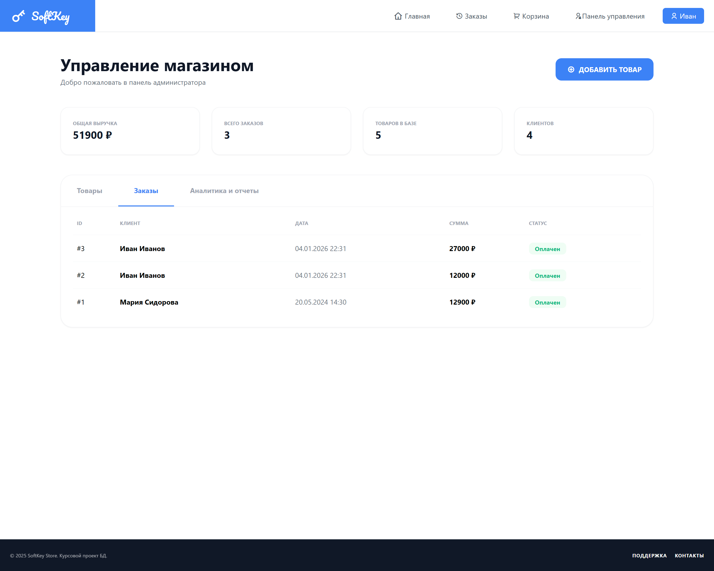
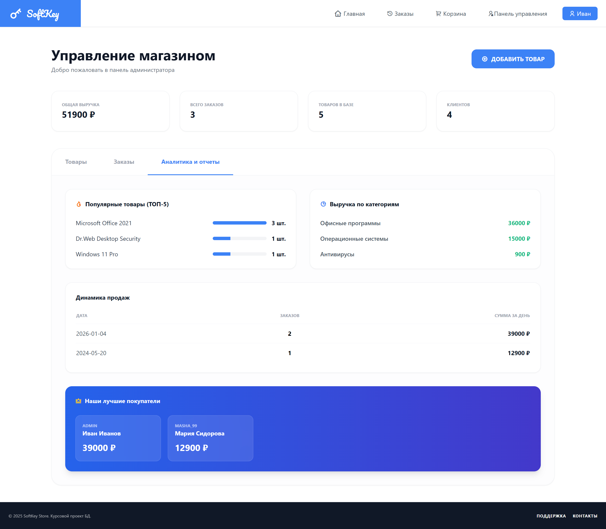

# 🔑 SoftKey Store — Магазин лицензионного ПО

Веб-приложение для продажи лицензионных ключей программного обеспечения, разработанное в рамках курсового проекта по дисциплине «Базы данных».

## 🚀 О проекте

Проект представляет собой полноценный интернет-магазин, специализирующийся на реализации цифровых товаров (ключей активации). Система включает в себя как пользовательский интерфейс для выбора и покупки ПО, так и защищенную панель администратора для управления ассортиментом и анализа продаж.

---

## 🖥️ Визуальная демонстрация

<div align="center" style="background-color:#0d1117; padding: 20px; border-radius: 15px;">

<h3 align="center" style="color:#fff;">🔐 Авторизация и доступ</h3>


<sub style="color:gray;">Двухпанельный экран входа с системой валидации данных</sub>


<h3 align="center" style="color:#fff;">🛍️ Витрина товаров и фильтрация</h3>


<sub style="color:gray;">Главная страница с поиском, категориями и сортировкой по цене/дате</sub>


<h3 align="center" style="color:#fff;">📜 Детальное описание товара</h3>


<sub style="color:gray;">Карточка товара с опсианием и списком доступных лицензий</sub>


<h3 align="center" style="color:#fff;">🛒 Корзина и оформление</h3>



<sub style="color:gray;">Процесс оформления заказов и автоматический расчет итоговой стоимости</sub>


<h3 align="center" style="color:#fff;">📦 Мои заказы и ключи</h3>


<sub style="color:gray;">История покупок с функцией мгновенного копирования ключа в буфер обмена</sub>


<h3 align="center" style="color:#fff;">🛠️ Панель администратора</h3>

<table align="center">
  <tr>
    <td align="center" valign="top">
      <br>
      <sub>Управление товарами и редактирование</sub>
    </td>
    <td align="center" valign="top">
      <br>
      <sub>Список заказов всех покупателей</sub>
    </td>
    <td align="center" valign="top">
      <br>
      <sub>Отчёты, аналитика и список ценных клиентов</sub>
    </td>
  </tr>
</table>
</div>

---

## 📋 Функциональность

* ✅ **Система авторизации** — регистрация и вход для пользователей и администраторов.
* 🔍 **Умный каталог** — поиск по названию, фильтрация по категориям и многоуровневая сортировка.
* 🛒 **Корзина покупок** — добавление товаров, управление количеством и сохранение состояния.
* 💳 **Оформление заказов** — генерация уникальных лицензионных ключей после "покупки".
* 📊 **Админ-дашборд** — статистика по выручке, количеству заказов и популярным категориям.
* 📝 **Управление контентом** — добавление, редактирование и "мягкое" удаление товаров через интерфейс.
* 🔐 **Личный кабинет** — изменение персональных данных и смена пароля с валидацией сложности.
* 📱 **Современный UI** — адаптивный дизайн на Tailwind CSS с использованием иконок Remix Icon.

## 🛠️ Технологии

### Backend:

* **Flask** — основной веб-фреймворк.
* **Python** — серверная разработка.
* **PyMySQL** — драйвер для связи с базой данных MySQL.
* **Werkzeug** — обработка файлов, загрузка изображений и безопасность.
* **UUID** — генерация уникальных идентификаторов заказов и ключей.

### Frontend:

* **HTML5 / Tailwind CSS** — современная верстка и стилизация.
* **JavaScript (ES6+)** — интерактивные элементы, работа с корзиной и модальными окнами.
* **Remix Icons** — библиотека системных иконок.

### База данных:

* **MySQL** — реляционная СУБД (хранение пользователей, товаров, категорий и заказов).

## ⚡ Быстрый старт

### Предварительные требования

* Python 3.8+
* MySQL 8.0+

### Установка зависимостей:

```bash
pip install Flask PyMySQL Werkzeug

```

### Настройка базы данных:

* Создайте базу данных в MySQL (например, `softkey_db`).
* Импортируйте структуру таблиц из SQL-дампа.
* Настройте параметры подключения в файле `config.py`:

```python
host = "localhost"
user = "your_username"
password = "your_password"
port = 3306
db_name = "softkey_db"

```

### Запуск приложения:

```bash
python app.py

```

Приложение будет доступно по адресу: `http://localhost:5000`

### 📁 Структура проекта

```text
softkey_store/                   # Корень проекта
│
├── static/                      # Статические файлы
│   ├── css/                     # Кастомные стили
│   ├── images/                  # Загруженные изображения товаров
│   └── uploads/                 # Прочие медиа-файлы
│
├── templates/                   # HTML-шаблоны Jinja2
│   ├── base.html                # Общий каркас (шапка/подвал)
│   ├── index.html               # Витрина товаров
│   ├── login.html               # Вход
│   ├── register.html            # Регистрация
│   ├── product_detail.html      # Карточка товара
│   ├── cart.html                # Корзина
│   ├── orders.html              # История заказов
│   ├── profile.html             # Личный кабинет
│   └── admin.html               # Панель администратора
│
├── app.py                       # Основная логика Flask и маршруты
├── config.py                    # Конфигурация БД и секретные ключи
└── requirements.txt             # Список зависимостей

```

### 👨‍💻 Разработчик


**Григорьев Андрей Сергеевич**


<p align="center"><sub>© Разработано в рамках курсового проекта 2025</sub></p>
